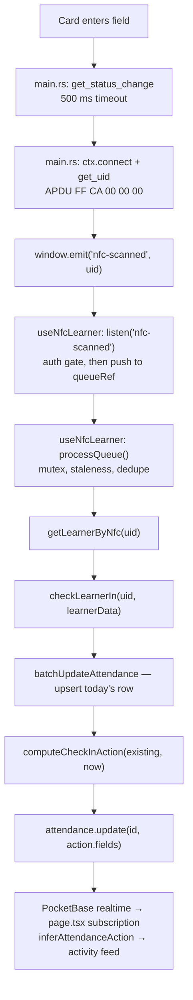

# nfc-attender — internal architecture

This is the map. The app is 13 components, 5 hooks, 5 `src/lib/` modules, 4 routes,
a Rust shell, and a separate Rust CLI, which is more than a README can carry
without becoming useless. Read this when you need to find where a behaviour lives;
read [`../README.md`](../README.md) when you need to build, run, or ship it.

Two references this file deliberately does not duplicate:

- PocketBase collection fields and rules → [`../../../docs/POCKETBASE.md`](../../../docs/POCKETBASE.md)
- Vocabulary (`lg`, `arrival`, `justified`, program codes) → [`../../../docs/GLOSSARY.md`](../../../docs/GLOSSARY.md)

Three constraints shape everything below, so they come first:

1. **There is no server.** `output: "export"` means the frontend is a folder of
   static files. Every read and write goes from the WebView straight to hosted
   PocketBase.
2. **Every write is client-side and optimistic.** The dashboard mutates local state
   first, then writes, then rolls back on failure. There is no transaction.
3. **The app is not the only writer.** The ESP32 firmware writes the same
   `attendance` rows. That is why the live activity feed is driven off PocketBase
   realtime events rather than off local scan results.

---

## Static export: what it buys and what it forbids

`next.config.ts`:

```ts
{ reactCompiler: true, output: "export", images: { unoptimized: true } }
```

`output: "export"` makes `next build` emit `out/` — plain HTML/JS/CSS with no Node
runtime. `tauri.conf.json` sets `frontendDist: "../out"`, so that folder *is* the
desktop app's frontend, served from the bundle. `images.unoptimized` is forced by
the same choice: `next/image` optimization needs a server.

The consequences are absolute, and they are the single most common way to break
this app:

| You cannot | Because |
| --- | --- |
| Add a Route Handler (`app/api/**/route.ts`) | Static export has nothing to execute it. There is no `route.ts` anywhere in the repo, and there cannot be one here |
| Add a Server Action | Same |
| Use `cookies()`, `headers()`, server-side `redirect()` | Same |
| Render a Server Component that fetches data | Every data-touching component is `"use client"` |
| Use `next/image` optimization, ISR, or middleware | No server |
| Read a runtime env var | The bundle is baked at build time |

So all data fetching happens in client components, in `useEffect`, against a single
PocketBase client. The one `process.env` read in this whole app is `NODE_ENV` in
`src/lib/debug.ts`, and that is resolved at build time, not runtime.

### `window.__pb`

`src/app/pb.ts` is ten lines and worth understanding exactly:

```ts
function getPb() {
  if (typeof window !== "undefined" && window.__pb) return window.__pb;
  const instance = createPBClient({ url: PB_URL });
  if (typeof window !== "undefined") window.__pb = instance;
  return instance;
}
export const pb = getPb();
```

The client is cached on `window.__pb` rather than in module scope. Module scope
would be enough for a single bundle, but a static export plus Next's dev-time
module reloading can evaluate the module more than once, and each fresh PocketBase
instance brings its own `authStore` and its own realtime SSE connection. Two
instances means the auth state the UI reads and the auth state a write uses can
disagree, and it means duplicate realtime subscriptions producing duplicate
activity-feed entries. Pinning to the window makes "one client per window" true by
construction.

Practical rules:

- **Import `pb` from `@/app/pb`. Never construct a `PocketBase`.** A second client
  reintroduces exactly the split-brain the singleton exists to prevent.
- `pb.authStore` is the only auth state. `useIsPrivileged` subscribes to it via
  `useSyncExternalStore`; `useNfcLearner` reads it synchronously to gate writes.
- The type declaration for `window.__pb` is a `declare global` in `src/app/pb.ts`.
  It is the only global augmentation in the app.
- `eslint.config.mjs` makes `react/no-danger` an **error** here rather than a
  warning, and its comment says why: user-supplied content renders in a desktop
  WebView holding a live PocketBase auth token on `window.__pb`, so an injection is
  an account compromise, not a defacement.

---

## The NFC scan data flow, end to end

This is the path a physical card tap takes when the *local PC/SC reader* is used.
The deployed path is the ESP32 firmware, which skips hops 1–5 entirely and writes
to PocketBase itself — see hop 10.



Hop by hop, with the exact symbol at each:

**1. `start_nfc_listener` — `src-tauri/src/main.rs`.** Called once from the Tauri
`setup` hook with the `"main"` webview window. Spawns a `std::thread` and never
joins it; the thread owns the reader for the process lifetime.

**2. The poll loop.** Two nested loops. The outer one re-establishes the PC/SC
context and re-lists readers, sleeping 5 s between attempts, so unplugging the
reader is recoverable rather than fatal. The inner one calls
`ctx.get_status_change(Some(Duration::from_millis(500)), &mut states)`. That is a
*blocking wait with a 500 ms timeout*, not a busy poll: the thread sleeps until
either the reader state changes or 500 ms elapses. The practical upper bound on
detection latency is therefore 500 ms, at approximately zero idle CPU.

**3. Edge detection.** `card_present` and `last_uid` are thread-local mutable
state. A connect is attempted only on the `!card_present → PRESENT` transition, and
an event is emitted only when the UID differs from `last_uid`. Card removal sets
`card_present = false` and clears `last_uid`. This is the first of three layers of
duplicate suppression — a card dwelling in the field would otherwise fire
continuously.

Two things about this guard are worth knowing precisely, because it is easy to
credit it with more than it does.

**`last_uid` is structurally dead.** It is only ever *read* at the moment
`!card_present` flips true, and the only code path that sets `card_present = false`
also clears `last_uid` in the same branch. So at every point the comparison
`uid != last_uid` is evaluated, `last_uid` is guaranteed to be empty, and the
comparison always passes. The sole effective guard is the `card_present` boolean.
Removing `last_uid` would not change behaviour.

**It has diverged from the firmware, which fixed a bug this path still has.** The
ESP32's `src/nfc.h` was originally a port of this logic (its comment cites
`main.rs:74-97`). The firmware has since replaced the absent→present edge rule with
a **1500 ms UID-keyed time window**, because the PN532 intermittently reports "no
target" for a single poll while a card is still physically on the reader. Under the
edge rule that transient false negative clears the "present" flag, and the very next
detection is counted as a fresh tap — a duplicate scan from one physical
presentation.

This Rust path never received that fix, so **the same class of duplicate-scan bug is
reachable through PC/SC** whenever the reader or the PC/SC daemon reports a
momentary non-`PRESENT` state for a card that never left the field. Whether that
actually happens with an ACR122U is **unverified** — PC/SC state comes from the
daemon rather than from raw polling, so it is plausibly more stable than the PN532's.
But the two tap paths no longer debounce alike, and a reader comparing them should
not assume they do.

The consequence is not symmetric across the day. A duplicate morning tap is absorbed
downstream: `processQueue`'s consecutive dedupe catches it if both events are queued
together, and `computeCheckInAction` returns `no_action` once `time_in` is set. But
**inside the lunch window (13:00–13:59) every accepted tap toggles out→in**, so a
duplicate that slips past the dedupe writes a spurious lunch event and inverts the
learner's recorded lunch state. That is the case where this matters.

**4. `get_uid` — `src-tauri/src/main.rs`.** Transmits the PC/SC pseudo-APDU
`FF CA 00 00 00` ("Get Data — UID"), a reader-level command that ACR122U-class
readers answer without any card-specific protocol. The response is
`UID || SW1 SW2`; the last two status bytes are dropped and the rest is
`hex::encode`d to lowercase. That lowercase hex string is the value stored in
`learners.NFC_ID`, so enrolment and lookup must agree on the encoding — which is
why `tools/enroll` carries a byte-identical copy of this function.

UIDs are credentials. The `println!` of a scanned UID sits behind
`#[cfg(debug_assertions)]`, so release builds never log them.

**5. `window.emit("nfc-scanned", uid)`.** A Tauri event, not a command — Rust
pushes, the frontend does not poll.

**6. `useNfcLearner` — `src/app/hooks/useNfcLearner.ts`.** Registers
`listen<string>("nfc-scanned", …)` once on mount. The listener callback does two
things and nothing else:

- **Auth gate.** Reads `pb.authStore.record?.role` synchronously and drops the scan
  unless `authStore.isValid` and the role is `admin` or `lg`. A scan arriving under
  a stale or learner-role session would otherwise attempt a write that either fails
  confusingly or lands under the wrong identity.
- **Enqueue.** Pushes `{ uid, timestamp: Date.now() }` onto `queueRef.current`,
  then calls `processQueue()`.

It also subscribes to `pb.authStore.onChange` and **clears the queue** on any auth
change, so a login or logout mid-burst cannot let a queued scan write under the
previous session.

**7. `processQueue` — the sequencer.** Why a queue rather than a "busy" flag:
readers fire multiple events per swipe, and arrival time is exactly when
back-to-back scans by different learners are legitimate. Dropping while in-flight
loses real taps. So everything is queued and drained one at a time:

| Guard | Rule | Motivation |
| --- | --- | --- |
| `processingRef` mutex | Only one drain loop runs | Two concurrent `checkLearnerIn` calls on one learner would race on the same row |
| Staleness | Discard jobs older than 30 s | A backlog from an offline period would otherwise replay old taps with current timestamps |
| Consecutive dedupe | Skip a job if the *next* queue item has the same UID | Collapses a dwelling card into its last event |

The dedupe compares against the next item, not the previous one, so it only
collapses runs already sitting in the queue. A slow double-tap 5 s apart is
processed twice and handled by the state machine's `no_action` branch instead.

`optionsRef` holds the latest `{ testTime, testDate }` so the once-registered
listener always sees current test-mode values without re-registering, and options
are captured at *processing* time, not at arrival time.

**8. UID → learner: `getLearnerByNfc`.** `src/lib/pb-client.ts` re-exports the
`@learnlife/pb-client` query with `pb` pre-bound. Returns `null` for an unknown
card; the hook then sets `exists = false`, which drives the header's
"Unknown · <uid prefix>" indicator and the kiosk's "Card not registered" screen.
The resolved record is passed forward as `learnerData` so `checkLearnerIn` does not
re-query.

**9. `checkLearnerIn` — `src/app/utils/utils.ts`.** The only place a scan becomes a
write. Four steps:

1. Resolve the learner (from `options.learnerData`, else query).
2. `withRetry(() => batchUpdateAttendance({ learnerId, date }))` — an **upsert**.
   It returns `{ existing, attendance }`; `existing` is the pre-update snapshot fed
   to the state machine, which matters because every decision the state machine
   makes hinges on which fields are already populated.
3. `computeCheckInAction(existing, now)` from `@learnlife/shared` — pure, no I/O.
4. `withRetry(() => pb.collection("attendance").update(existing.id, action.fields))`.

`no_action` returns early without a write. Failures are logged via `debug.error`
and return `null`; nothing is surfaced to the user, so a scan that did not take is
indistinguishable from one that did. That is a real gap, not a design decision.

`now` is `options.testTime || new Date()` and the date string is
`options.testDate || now.toISOString().split("T")[0]`. Note the asymmetry: the date
defaults to **UTC** (`toISOString`) while the state machine's hour/minute
comparisons use **local** `getHours()`. For a timezone east of UTC late in the
evening, the row's `date` and the wall-clock day disagree. Nothing in the deployed
timezone triggers this today; it is a latent bug, not an observed one.

#### Known data-correctness bug: `justified` is never written on check-in

This is the most consequential defect in the app, and it is invisible in the UI.

`AttendanceState` — the snapshot type `computeCheckInAction` accepts — has **no
`justified` field**. It carries `time_in`, `time_out`, `lunch_events`, `lunch_out`,
`lunch_in`, `status`, and `lunch_status`, and that is all. So the state machine
recovers prior justification the only way it can, by pattern-matching the *legacy*
enum:

```ts
const wasJustified = state.status === "jLate" || state.status === "jAbsent";
const status = deriveStatus(arrival, wasJustified);
return { type: "check_in", fields: { time_in, arrival, status } };
```

Note what `fields` contains: `time_in`, `arrival`, `status`. **Not `justified`.**
Step 4 above then writes `action.fields` verbatim through a raw
`pb.collection("attendance").update(...)`, so the `justified` column is left at
whatever it already held.

For a row whose `justified` boolean agrees with its `status` — anything written by
`handleSetStatus`, which always writes the pair — this is harmless. The break is on
rows where `status` says justified but the boolean does not: records created before
the split-status migration, and any row written by a path that set `status` alone.
A learner in that state who taps in ends up with:

| Field | Value | |
| --- | --- | --- |
| `arrival` | `"late"` | written by the scan |
| `status` | `"jLate"` | written by the scan, derived from the legacy enum |
| `justified` | `false` | **never written — stale** |

That row is internally contradictory, and the two halves are read by different
consumers. `summarizeAttendance` prefers the split fields, so **the reports count
that day as an ordinary unexcused late**, while anything reading `status` — the
status badges, the wall tile tone, the CSV `status` column — shows `jLate`. The
screen and the report disagree, and neither is obviously wrong to look at.

**Routing through `batchUpdateAttendance` would not fix it.** That is worth stating
because it is the natural assumption: `batchUpdateAttendance` applies
`withDerivedStatus`, which reconciles the split model — but its first guard is
`if ("status" in fields) return fields;`, and `action.fields` always includes an
explicit `status`. The reconciliation short-circuits. The gap is that **nothing on
the check-in path writes `justified` at all**, not that the write bypasses a helper.

A real fix means adding `justified` to `AttendanceState`, having
`computeCheckInAction` read the boolean instead of decoding the enum, and returning
it in `fields` — which touches `packages/shared`, its duplicate in
`packages/pb-client`, and the C++ port in the firmware. All three, or they drift
further. Until then, the workaround documented for guides in
[`USER_GUIDE.md`](USER_GUIDE.md) is to re-apply **JL** by hand after an excused
learner arrives, since `handleSetStatus` writes both halves correctly.

**10. The activity feed.** `page.tsx` does **not** feed the activity list from
`useNfcLearner`'s `lastAction`. It subscribes to
`pb.collection("attendance").subscribe("*")` and diffs each incoming record against
its previous snapshot via `inferAttendanceAction(prev, next)` (top of `page.tsx`).
This is deliberate and load-bearing: the ESP32 firmware writes the same rows, so
routing the feed through PocketBase realtime is the only way a firmware tap lights
up the dashboard. Local reader scans take the same path with one round-trip of
extra latency. `inferAttendanceAction` recognises five transitions:

| Detected | Condition |
| --- | --- |
| `check_in` | `time_in` went from empty to set |
| `check_out` | `time_out` went from empty to set |
| `late_lunch_return` | `lunch_events` grew, last is `type: "in"`, and `lunch_status === "late"` |
| `lunch_event` | `lunch_events` grew, any other shape |
| `auto_absent` | `arrival` flipped to `"absent"` with no `time_in` — a sweep write, distinguished from a guide pressing **A** |

Both the learners and attendance subscriptions debounce their refetch by 1000 ms.
The feed keeps the last 50 events (`arr.slice(-49)`). Subscription setup is wrapped
in try/catch because PocketBase realtime can 404 with "Missing or invalid client
id" when the SSE `client_id` goes stale during fast navigation; the next page load
re-subscribes.

### The attendance rule exists three times

`computeCheckInAction` and `deriveStatus` in `packages/shared/src/attendance.ts`
are the reference. Two copies exist:

| Copy | Why it exists | Sync mechanism |
| --- | --- | --- |
| `deriveStatus` in `packages/pb-client/src/queries/attendance.ts` | `pb-client` cannot import `shared` — `shared` imports `TIME_THRESHOLDS` from `pb-client`, so it would cycle | A `MUST STAY IN SYNC` banner comment. Nothing else |
| `apps/nfc-attender-fw/src/state_machine.cpp` | The ESP32 decides locally so it can queue taps while offline | A header comment citing the TS file and a line range. Nothing else |

**They have already drifted.** `TIME_THRESHOLDS.CHECKOUT_HOUR`/`CHECKOUT_MINUTE` is
`16:59`; the firmware's `CHECKOUT_HOUR`/`CHECKOUT_MINUTE` is `17:00`, and the
firmware adds a `LOCKED_END_HOUR` no-scan window the TypeScript has no concept of.
Nothing in CI compares them. Assume divergence and check both when touching either.

---

## Routes

Four routes, all client-rendered. There is no `loading.tsx`, `error.tsx`, or route
grouping; `layout.tsx` is the only shared shell.

| Route | File | Purpose |
| --- | --- | --- |
| `/` | `src/app/page.tsx` (1041 lines) | The dashboard. Owns all data state and every write handler; delegates rendering to `AttenderD` |
| `/kiosk` | `src/app/kiosk/page.tsx` | Legacy full-screen tap display. One big card per scan |
| `/history` | `src/app/history/page.tsx` (1578 lines) | Single-day roster with inline record editing and per-day CSV export |
| `/history/admin` | `src/app/history/admin/page.tsx` (1125 lines) | Range reports: per-learner and per-program rollups, sortable table, range CSV export |

### `layout.tsx`

The only server-rendered file, and it renders nothing dynamic. Loads three Google
fonts through `next/font/google` — Fraunces (`--font-heading`), Inter Tight
(`--font-body`), JetBrains Mono (`--font-mono`) — mounts `<ToastContainer/>`
globally, and sets the window title metadata to "LearnLife Attender".

`next/font` self-hosts the font files into the bundle at build time. That is what
lets the CSP be `font-src 'self'` with no Google origin allowed. Switching to a
`<link>` stylesheet would silently break the fonts in the packaged app.

### `/` — dashboard (`page.tsx`)

Holds all state. Everything below is `useState` in `AttendancePage`:

- **Data**: `students`, `attendanceMap` (`learnerId → attendance record`),
  pagination (`page`, `perPage` default 500, `totalPages`, `totalItems`).
- **Lifecycle**: `hasLoadedOnce` (gates skeletons — flips only after *both* fetches
  succeed, so a retry keeps showing skeletons rather than an empty table),
  `fetchError` (drives the retry banner).
- **Test mode**: `testMode`, `testTime`, `testDate`. `viewDate` derives from these
  or from today.
- **Demo overlay**: `demoMap`. When non-null, `effectiveAttendanceMap` reads from it
  and every write handler returns early after its optimistic update, so **no
  PocketBase writes happen at all**. `updateAttendanceState` routes an updater
  function to either `demoMap` or `attendanceMap` so no handler has to branch.
  Leaving test mode nulls `demoMap` — without that, the overlay would persist with
  no visible control to exit it.
- **Modals**: `showModal` (create learner), `justifyingLearnerId` + `justifyError`
  (justification reason; the error is lifted out of the modal so a failed save keeps
  the user's typed text), `helpOpen`.

`studentsWithAttendance` is a `useMemo` flattening each learner plus their
attendance row into one `Student` object (`src/app/types.ts`), sorted by name. The
two-pass shape exists because `useAttendanceFilters` needs the merged list and the
merged list needs the fetched data.

Write handlers, all optimistic-then-rollback:

| Handler | Writes | Notes |
| --- | --- | --- |
| `handleCheckAction(id, action)` | `morning-in`, `lunch-out`, `lunch-in`, `day-out` | Manual equivalents of the four scan outcomes. `morning-in` computes `arrival` from `TIME_THRESHOLDS.LATE_HOUR`/`LATE_MINUTE` and writes `time_in + arrival + status` in **one** call, specifically so the realtime subscription never observes a row with `time_in` set but `arrival` still null |
| `handleSetStatus(id, status, field, toggle)` | `arrival` + `justified` + `status`, or `lunch_status` | Maps the P/L/A/JL/JA buttons through `STATUS_BUTTON_MAP` to the canonical `(arrival, justified)` pair, then derives `status` via `deriveStatus`. Clicking the button matching current state clears the day. Sets `justified_by`/`justified_at` only on the flip to true. Retries once after 1 s on HTTP 429 |
| `handleTimeEdit(id, field, timeStr)` | `time_in` or `time_out` | Parses `HH:MM` against `viewDate` |
| `handleReset(id)` | `resetAttendance` | Assumes the caller already confirmed — the confirm dialog lives in `AttenderD`'s row menu and `WallView`'s bulk bar |
| `handleCommentUpdate(id, comment)` | `learners.comments` | Comments are on the **learner**, not the attendance row |
| `handleSaveJustificationReason(reason)` | `justifyAttendance` | Requires an existing attendance row; refuses with an inline message if there is none |
| `handleCreateLearner(...)` | `learners.create` | Thin wrapper over `createLearner` in `utils.ts` |
| `updateAttendance(id, field, opts)` | one field | Generic helper for callers passing a single field |

`lunch_status` deliberately keeps the legacy single-enum model. Only *morning*
status got the split `arrival`/`justified` treatment.

Global keyboard handling lives in two places, worth knowing before adding a
shortcut. `page.tsx` owns `?` (help — fires regardless of focus, since there is no
realistic text-entry case where `?` should also navigate), `h` (history), and `t`
(toggle test mode). `AttenderD` owns `/` (focus search), `1` (table view), `2`
(wall view). Both bail when focus is in an `INPUT`/`TEXTAREA`/`SELECT`/
`contenteditable` and on any modifier key. The overlay listing them
(`KeyboardHelpOverlay`) is a hand-maintained array — nothing checks that it matches
the listeners.

### `/kiosk`

A single-purpose full-screen display: idle prompt, or the last scan rendered huge
(avatar, name, program, status pill, "Xs ago"). Superseded by the firmware's own
OLED but still functional.

Two things distinguish it from the dashboard:

- It runs `useNfcLearner()` with **no options** (no test mode) purely for the
  `uid`/`exists` reader indicator, and derives the displayed scan from its own
  `attendance` realtime subscription using a local `inferAction` plus a
  `prevRecordsRef` snapshot map. So it too displays firmware taps.
- It also runs `useAutoAbsentSweep`. That is intentional: a kiosk left open is a
  place the sweep can run, and it is the only reason a kiosk-only deployment marks
  anyone absent.

`inferAction` here returns `lunch_out`/`lunch_in` where the dashboard's
`inferAttendanceAction` returns `lunch_event`/`late_lunch_return`. Two similar
functions, different vocabularies, no shared code.

### `/history`

One row per **learner**, not per record. `allRows` merges the full roster against
the day's records so a learner with no attendance row still appears — a
records-only view silently hid exactly the people you are looking for.

- Two view modes: `story` (default; three columns — here / justified / missing —
  because the original per-learner ribbon design made every row look identical) and
  `table` (dense, retained for power users). `groupRosterRows` is the pure grouping
  helper, exported for tests.
- Inline edit modal (`startEditing` / `saveEditing`) covers `time_in`, `time_out`, a
  single lunch out/in pair, `arrival`, `justified`, `justification_reason`, and
  `lunch_status`. `arrival` falls back to `splitStatus(record.status)` for rows not
  touched since the split-status migration. `justified` is forced false unless
  `arrival` is `late` or `absent`.
- **Known data-loss path, guarded but not solved**: the edit modal collapses
  `lunch_events` to one out/in pair, so a learner with more than two events loses
  the extras on save. The code calls `confirm()` first — and `window.confirm` is
  exactly what does not render in Tauri's WKWebView (see `ConfirmModal` below), so
  in the packaged app that guard most likely returns `false` and silently cancels
  the save rather than prompting. **Unverified against a packaged build**, and a
  real risk in either direction.
- `resetRecord` and the save-failure path also use `confirm`/`alert`. Same caveat.
- Counts delegate to `summarizeAttendance` from `@learnlife/shared`; learners with
  no row at all are counted locally as `missing`, since the shared helper has no
  concept of roster-versus-records.
- `downloadDailyCsv` — one row per learner for the day, with raw ISO timestamps so
  the file is useful for analysis rather than just mirroring the screen. A trailing
  `out` lunch event with no matching `in` renders as `(no return)` so a reader does
  not have to parse the JSON column. Saves via `saveTextFile`. **No audit log
  entry** — unlike the admin export.
- The auth check here is `pb.authStore.isValid` only, so a `learner`-role account
  would pass where `useIsPrivileged` rejects it on `/` and `/history/admin`. An
  inconsistency rather than an exploit path on its own — PocketBase collection
  rules are the real gate — but worth knowing.

### `/history/admin`

Range reports. Its own auth check requires role `admin` or `lg` and pushes to `/`
otherwise, gating render on `authChecked` so no data request fires before the check
completes.

- Range presets `1d / 3d / 7d / 14d / month / custom`, resolved by `resolveRange()`
  in `useAdminHistoryData`. Default `7d`.
- Sortable per-learner table (`SortKey` covers name, program, the five status
  counts, `missing`, average in/out times, late lunches, missing checkouts, and
  attendance percentage), expandable into `DailyDetailRow` per-day drill-down.
- Per-program rollup cards via `buildProgramTotals`, with `AttendanceBar`.
- Rate math comes from `computeAttendanceRates` and `formatMinutesOfDay` in
  `@learnlife/shared`.
- `downloadCsv` for the range, and this one **does** call
  `logAuditEvent("csv_export", …)` — fire-and-forget, never blocking the download.
  It is the only `logAuditEvent` call site in the repository.

---

## Hooks (`src/app/hooks/`)

| Hook | Used by | When it runs | What it does |
| --- | --- | --- | --- |
| `useNfcLearner` | `/`, `/kiosk` | Listener registered once on mount; drains on each event | Tauri `nfc-scanned` listener + scan queue + `checkLearnerIn`. Returns `{ uid, learner, exists, isLoading, lastAction, simulateScan }`. `simulateScan(uid)` injects a scan with no reader — that is what test mode uses |
| `useIsPrivileged` | `/`, `/kiosk` | Continuously, via `useSyncExternalStore` on `pb.authStore.onChange` | `true` iff `authStore.isValid` **and** role is `admin` or `lg`. `getServerSnapshot` returns `false` because the static export prerenders the signed-out shell — this is the fix for the hydration-mismatch crash a synchronous `useState` initializer caused in `AttenderD` |
| `useAttendanceFilters` | `/` | On every change to the merged learner list or any filter | Search (300 ms debounce), program filter, presence/status filter, and the per-category counts the filter pills display. `getPresenceState` classifies `out` / `lunch` / `here` / `away` from `time_out`, the last `lunch_events` entry, and `time_in`, in that order |
| `useAutoAbsentSweep` | `/`, `/kiosk` | Immediately when enabled, then every 60 s | Marks unscanned learners absent past the cutoff. **This is the entire absence mechanism.** See [`../README_SCHEDULER.md`](../README_SCHEDULER.md) |
| `useAdminHistoryData` | `/history/admin` | On mount and on any range/program change | Fetches learners (`perPage: 500`) and all attendance in range (`perPage: 200`), builds `LearnerRow[]` including learners with zero records, and computes `expectedDays` via `countWeekdays` — the denominator for attendance rates. It exists because a day where a learner never scanned and no absent row was created would otherwise vanish from the math entirely |

`useAttendanceFilters` has one subtlety worth not "fixing" by accident: the name and
program predicate only applies **while `search !== debouncedSearch`**, i.e. while
the user is typing ahead of the debounce. Once the debounce settles, the server
query has already narrowed the list, so filtering again locally would be redundant.

---

## Components (`src/app/components/`)

### Design system

**`ll-ui.tsx`** — the shared atom set. Every dashboard and history surface imports
from here; nothing else defines a visual primitive. Exports the style constants
`HEADING`, `KICKER`, `MONO`, the `ScanState` union (`in | lunch | out | absent`),
and the components `Kicker`, `Heading`, `Pill`, `StatusPill`, `StatusBadge`,
`Avatar`, `BigStat`, `LMark`, `InkInput`, `InkSelect`.

#### The palette has two sources of truth, and nothing guards them

This app **does not depend on `@learnlife/design-tokens`**. There is no reference to
it anywhere in `apps/nfc-attender/` — not in `package.json`, not in any `.ts`,
`.tsx`, `.css`, or config file. Instead, `src/app/globals.css` re-declares all
thirteen light-mode colour values as CSS custom properties (`--ll-bg`,
`--ll-surface`, `--ll-surface-2`, `--ll-ink`, `--ll-ink-2`, `--ll-muted`,
`--ll-divider`, `--ll-accent`, `--ll-accent-ink`, `--ll-warm`, `--ll-warm-ink`,
`--ll-lime`, `--ll-lime-ink`) under a "locked from design handoff" comment, then
re-exposes each one to Tailwind v4 through an `@theme inline` block as
`--color-ll-*`.

**For this app, `globals.css` is authoritative.** Editing `colorsLight` in
`packages/design-tokens` has no effect here whatsoever.

The duplication is currently invisible because every value is identical to the
package's `colorsLight` (the package writes them uppercase, the CSS lowercase —
the same hex). That is exactly what makes it dangerous: there is **no generator
emitting CSS from the TS constants and no test comparing them**, so the first edit
to either side silently desynchronises the calendar app from the dashboard, and the
drift shows up as a colour that looks slightly wrong in one app and nobody knows
why. Changing a colour means editing both, deliberately.

Two keys exist in the package with no CSS counterpart: the `lavender` /
`lavenderInk` aliases, which the package maps onto the sage accent for
backwards-compatibility. Nothing in this app references them.

### Dashboard

**`AttenderD.tsx`** (2286 lines) — the entire dashboard chrome and both views, and
the largest file in the app. Presentational: it takes ~30 props from `page.tsx` and
owns only view-local state (`viewMode`, `selectedIds`, `sidebarOpen`, inline-edit
buffers, `resetTarget`). It also exports pure helpers the tests import directly:

| Export | Role |
| --- | --- |
| `AttenderD` | Header (on-site hero count, reader indicator, add-learner), toolbar (search, status pills, program pills, view switcher, tools), body, pagination, footer, sign-out |
| `WallView` | Grid-of-tiles view. Owns its own select mode and bulk reset, confirmed through `ConfirmModal` |
| `StatusEditor` | The P / L / A / JL / JA button row plus lunch status and the reason affordance |
| `ScanHistoryCell` / `buildScanHistory` | Per-row expandable timeline of the day's events, reconstructed from timestamps and `lunch_events` |
| `getWallTone` | Tile colour/border/flag. Factors the manual `status` field on top of presence, because otherwise Late looks identical to Present and Justified Absent looks identical to a no-show |
| `formatTimeShort`, `lunchLabel`, `shortCardNum` | Formatting |
| `FetchErrorBanner` (module-private) | Pinned retry banner while `fetchError` is set |

Two bulk-action surfaces exist with different capabilities. The **table** bulk bar
(appears when `selectedIds.size > 0`) offers check-in-all, check-out-all,
mark-absent, mark-justified-absent, clear-selection. The **wall** bulk bar offers
only reset. Both iterate the selection calling the single-learner handler per id —
there is no batch endpoint, so N selected rows means N PocketBase writes, and no
audit entry (see the audit section).

**`attender/RowOverflowMenu.tsx`** — per-row `⋯` menu: edit check-in time, edit
check-out time, edit note, edit justification reason, view scan history (reusing
`buildScanHistory`), reset. Closes on outside click and Escape.

**`ActivityFeed.tsx`** — the collapsible "Live" sidebar. Renders `ActivityEvent[]`
(the type other modules import from here) with auto-scroll to newest. `ACTION_LABEL`
maps *both* vocabularies — the realtime-derived `check_in` / `check_out` /
`lunch_event` / `late_lunch_return` and the manual-button `morning-in` /
`lunch-out` / `lunch-in` / `day-out` — into one set of labels.

### Modals and overlays

All render through `createPortal` and guard on `typeof document === "undefined"` (or
a `mounted` flag) so the static prerender emits no dialog markup. All bind Escape to
close and lock `body.overflow`.

| Component | Purpose |
| --- | --- |
| `ConfirmModal.tsx` | Replacement for `window.confirm`. **Tauri 2's WKWebView does not render JS-native `confirm()`**, so every code path gated on it silently no-op'd. Cancel is `autoFocus`ed and Enter is deliberately not bound globally, because the default answer to a destructive prompt should be "no" |
| `CreateLearnerModal.tsx` | Name, email, program (Changemaker / Explorer / Creator), DOB, and the NFC UID — prefilled from the last scan, which is the intended in-app enrolment flow |
| `JustificationModal.tsx` | Edit a justification reason. Takes an already-resolved `justifiedByName` so it never renders a raw user FK. Its error prop is owned by the parent so a failed save keeps the typed text |
| `KeyboardHelpOverlay.tsx` | The `?` overlay. A hand-maintained `GROUPS` array; keep it adjacent to listener changes in a PR, since nothing enforces the match |
| `UpdateNotification.tsx` | Blocking updater modal. Phases `idle → available → downloading → ready → error`; calls `check()` on mount, `update.downloadAndInstall()` with byte progress, then `relaunch()`. Mounted on `/` and `/kiosk` only |
| `TestModePanel.tsx` | Fixed bottom panel when test mode is on. Time presets (9 AM, 10 AM, 1 PM, 1:30 PM, 2 PM, 5 PM, 6 PM), date override, a learner picker that calls `simulateScan`, and the demo overlay Load/Clear buttons |

### Infrastructure

| Component | Purpose |
| --- | --- |
| `Account.tsx` | Sign-in form. **Sign-in only** — the sign-up tab was removed in a security pass, because `lg`/`admin` accounts are seeded in the PocketBase admin UI and learner accounts are invite-driven from the calendar app. Error copy deliberately does not distinguish wrong-email from wrong-password; status 0 / 429 / 5xx get distinct messages |
| `Toast.tsx` | Module-level toast store + `useSyncExternalStore` + a single portaled `ToastContainer` mounted in `layout.tsx`. No context, so any component can `toast.success(...)` without prop-drilling. `duration: 0` means sticky |
| `ErrorBoundary.tsx` | Class-component subtree boundary with a retry fallback. `page.tsx` wraps `AttenderD` in one so a single broken card cannot blank the dashboard. Catches **render** errors only — async rejections and event-handler throws need call-site handling |
| `LoadingSkeleton.tsx` | `LearnerRowsSkeleton` (default 6) and `LearnerWallSkeleton` (default 18). Both mirror the real grid columns so nothing shifts when data lands |

---

## `src/app/utils/` and `src/lib/`

The split is not by layer, it is historical: `src/app/utils/` predates `src/lib/`.
Treat them as one utility surface and prefer `src/lib/` for new code.

| Module | Purity | Contents |
| --- | --- | --- |
| `app/utils/utils.ts` | Impure — writes | `checkLearnerIn` (the scan→write path above), `createLearner`, `getAttendanceForDate` |
| `app/utils/format.tsx` | Pure | `prettyTimestamp` — same-day → time, within 7 days → weekday, older → date. `compact` returns a string; otherwise JSX |
| `app/utils/programHelpers.ts` | Pure | `programColor`, `programLabel` (`exp → EXP`, `cre → CRE`, else `CHMK`) |
| `lib/pb-client.ts` | Impure | Binds the singleton `pb` into every `@learnlife/pb-client` query so callers write `pbClient.listLearners({...})` without threading `pb`. Also holds the app-specific `updateAttendance` single-field editor |
| `lib/debug.ts` | Pure-ish | `debug.log/warn/error`, gated on `NODE_ENV !== "production"`. `error` always fires but prints only `"[error]"` with no payload in production, so learner names, NFC UIDs, and PocketBase error bodies never reach a screen recording or Console.app. This is the app's only `process.env` read |
| `lib/audit.ts` | Impure — writes | `logAuditEvent(action, details)`. See below — the audit trail is thinner than it looks, for two independent reasons |
| `lib/file-save.ts` | Impure — writes | `saveTextFile`. See below |
| `lib/demo-data.ts` | Pure | `buildDemoAttendanceMap(students, when)` |

### Program codes: `PROGRAM_CODES` is not the complete list

`PROGRAM_CODES` in `packages/pb-client/src/constants.ts` declares three:
`chmk` (Changemaker), `cre` (Creator), `exp` (Explorer). A **fourth code, `pf`
("Pathfinders"), exists only as a hard-coded entry in three label maps in this
app** and appears nowhere in the constant:

| File | Symbol |
| --- | --- |
| `src/app/components/AttenderD.tsx` | `PROGRAM_LABEL` |
| `src/app/history/page.tsx` | `PROGRAM_LABEL` |
| `src/app/kiosk/page.tsx` | `PROGRAM_LABEL` |

Nothing is broken today — a learner with `program: "pf"` renders as "Pathfinders"
on the dashboard, in history, and on the kiosk. The consequence is narrower and
easy to miss: **the admin reports program filter builds its options by iterating
`Object.entries(PROGRAM_CODES)`**, so it will never offer Pathfinders. Reporting on
that cohort means leaving the filter on "All programs" and narrowing by search or in
the exported CSV.

Two follow-on traps for anyone touching program codes:

- `programHelpers.ts` and the three `PROGRAM_LABEL` maps both fall through to
  Changemaker for unknown codes (`programLabel` returns `"CHMK"` for anything that
  is not `exp` or `cre`). So a fifth code would silently display as Changemaker
  rather than as an obvious placeholder.
- `CreateLearnerModal`'s `PROGRAM_OPTIONS` is a fourth hard-coded list, offering
  only the three canonical codes. A Pathfinder cannot be created from the app; the
  code has to be set in the PocketBase admin UI. `tools/enroll` has the same
  three-way prompt.

Treat `PROGRAM_CODES` as "the codes the reporting layer knows about", not as the set
of codes the database contains. The vocabulary is described in
[`../../../docs/GLOSSARY.md`](../../../docs/GLOSSARY.md).

### `lib/pb-client.ts` — the single-field editor

Everything except `updateAttendance` is a one-line binding. `updateAttendance` is
this app's own writer and validates before touching PocketBase, because the inline
time and status editors pass field names as plain strings and a typo would otherwise
create a junk column or store an unknown enum value:

- The field must appear in one of `TIMESTAMP_FIELDS` (`time_in`, `time_out`,
  `lunch_out`, `lunch_in`, `justified_at`), `STATUS_FIELDS` (`status`,
  `lunch_status`), `ARRIVAL_FIELDS` (`arrival`), `TEXT_FIELDS`
  (`justification_reason`, `justified_by`), `BOOLEAN_FIELDS` (`justified`), or
  `JSON_FIELDS` (`lunch_events`).
- Status values must be in `ALLOWED_STATUSES`; arrival values in `ALLOWED_ARRIVALS`.
- `date` must match `/^\d{4}-\d{2}-\d{2}$/`.
- Get-or-create on the `(learner, date)` pair.
- A timestamp field that already has a value returns `{ status: "already_set" }`
  rather than overwriting, unless `force: true`.
- Booleans are coerced to real booleans, so PocketBase stores `true` and not the
  string `"true"`.

These allow-lists are a **third** copy of the field and enum vocabulary, alongside
`packages/pb-client/src/constants.ts` and the PocketBase collection schema itself
(documented in [`../../../docs/POCKETBASE.md`](../../../docs/POCKETBASE.md)). Adding
a status means editing all three.

### `lib/audit.ts` — a narrower audit trail than the code suggests

`logAuditEvent` writes `{ actor, action, details }` to the `audit_log` collection,
wrapped in a `try/catch` that swallows **every** failure — missing collection,
offline, permission denied — and only `debug.warn`s. That part is intentional and
correct: auditing is observability, not a gate, and a CSV download must not fail
because the audit write did. The collection's fields and rules are documented in
[`../../../docs/POCKETBASE.md`](../../../docs/POCKETBASE.md) and are not restated
here.

There are **two independent reasons the audit trail may be thinner than it looks**,
and they compound:

**1. Two of the three declared actions are never emitted.** `AuditAction` declares
`csv_export`, `history_admin_view`, and `bulk_attendance_edit`. A repo-wide search
finds exactly one `logAuditEvent` call site — `csv_export`, in
`src/app/history/admin/page.tsx`. So:

| Action | Emitted? | Consequence |
| --- | --- | --- |
| `csv_export` | Yes, from `/history/admin` only | The per-day CSV on `/history` is **not** audited |
| `history_admin_view` | **Never** | Opening the admin reports page leaves no trace |
| `bulk_attendance_edit` | **Never** | Bulk mark-absent / mark-justified-absent / bulk-reset leave no trace, in either the table or the wall bulk bar |

Bulk attendance editing is the highest-consequence action in the app — one click can
rewrite the day for the whole roster — and it is the one with no audit record. The
type declares the intent; the call sites were never added.

**2. Even `csv_export` may be silently discarded.** `pb_hooks/README.md` marks
`audit_log` as "optional, but recommended". If the collection was never created in
the PocketBase admin console, `logAuditEvent` throws, the catch swallows it, and
there is no way to tell from inside the app. **Not verifiable from this repo:**
whether `audit_log` exists on `learnlife.pockethost.io`. The backend is hosted and
its schema is not in version control.

Net effect: the absence of an audit row proves nothing. It could mean the action was
never audited by design, or that the collection does not exist.

### `lib/file-save.ts` — why CSV export is not an anchor

The module exists because of one failure: in the Tauri build, an `<a download>` blob
anchor does nothing at all in WKWebView. The user clicks Export and there is no
error, no file, no feedback.

`saveTextFile` detects Tauri via `"__TAURI_INTERNALS__" in window` (the most reliable
cross-version marker) and takes one of two paths. Inside Tauri: a native save sheet
through `@tauri-apps/plugin-dialog`'s `save()`, then `@tauri-apps/plugin-fs`'s
`writeTextFile()`. In a browser: the blob-anchor fallback, which works fine outside
Tauri. Both plugin imports are **dynamic**, which keeps the plugin code out of the
browser bundle and keeps the module importable from environments where the plugin
packages are not in the dependency graph. Returns `{ saved: false }` when the user
cancels the dialog.

### `lib/demo-data.ts` — deterministic fake data

`buildDemoAttendanceMap` synthesizes an `attendanceMap`-shaped object from the real
roster, with the same field names and value types, so no consumer branches on "is
this real". Distribution: 55% present on time (check-in scattered 8:40–9:05), 10%
late (9:10–9:45), 10% currently at lunch, 7% checked out, 10% justified absent with
a reason, 8% no check-in.

The bucket comes from `hash(learner.id) % 100`, not from a random draw, and that is
the point: toggling demo mode off and on mid-presentation must not reshuffle who is
late and who is absent.

---

## The Rust ↔ TypeScript boundary

Small and one-directional. **There are no Tauri commands.** `main.rs` never calls
`.invoke_handler(...)`, so the frontend cannot call into this app's own Rust at all.
Everything crossing the boundary is either an event pushed from Rust or a *plugin*
command.

### Events (Rust → TS)

| Event | Payload | Emitted from | Consumed by |
| --- | --- | --- | --- |
| `nfc-scanned` | `String` — lowercase hex UID | `start_nfc_listener`, on a new-card edge | `useNfcLearner` |
| `nfc-error` | `String` — human-readable message | `start_nfc_listener`, on PC/SC context failure or when no readers are found | **Nobody.** No frontend code listens for it |

`nfc-error` being unconsumed is a real gap: an unplugged or failed reader is
invisible in the UI. The header's "Reader live · ACR122U" indicator is derived from
`uid`/`exists`, so it reads "live" even when no reader has ever been found.

### Plugin commands (TS → Rust)

Registered in `main.rs`'s builder chain: `tauri_plugin_updater`,
`tauri_plugin_process`, `tauri_plugin_dialog`, `tauri_plugin_fs`, plus core
`app:version`.

| Call site | API | Plugin |
| --- | --- | --- |
| `page.tsx` | `getVersion()` | core `app` |
| `UpdateNotification.tsx` | `check()`, `update.downloadAndInstall()` | updater |
| `UpdateNotification.tsx` | `relaunch()` | process |
| `lib/file-save.ts` | `save()` | dialog |
| `lib/file-save.ts` | `writeTextFile()` | fs |
| `useNfcLearner.ts` | `listen()` | core `event` |

### `capabilities/default.json`

Tauri 2 denies plugin commands unless a capability grants them. The `default`
capability applies to the `main` window only, and every entry maps to exactly one of
the calls above:

| Permission | Needed by |
| --- | --- |
| `core:app:allow-version` | `getVersion()` in the dashboard footer |
| `core:event:default` | `listen("nfc-scanned")` |
| `core:webview:default`, `core:window:default` | Baseline window and webview operations |
| `process:allow-restart` | `relaunch()` after an update |
| `updater:default` | `check()` and `downloadAndInstall()` |
| `dialog:allow-save` | The CSV save sheet. `allow-save` only — no open, no message, no confirm |
| `fs:allow-write-text-file`, scoped to `$HOME/**`, `$DESKTOP/**`, `$DOCUMENT/**`, `$DOWNLOAD/**`, `$TEMP/**` | `writeTextFile()` for the CSV. Write-only, and only under those roots |

Adding a Tauri API call means adding a permission here, or it fails at runtime with a
permission error rather than at build time.

### Content Security Policy

`tauri.conf.json` → `app.security.csp`:

```
default-src 'none'; connect-src 'self' https://learnlife.pockethost.io wss://learnlife.pockethost.io;
script-src 'self'; style-src 'self' 'unsafe-inline'; img-src 'self' data: https://learnlife.pockethost.io;
font-src 'self'; frame-ancestors 'none'; object-src 'none'; base-uri 'self'; form-action 'self'
```

Default-deny with exactly one allowed origin. Two implications for anyone changing
the frontend: pointing PocketBase at a different host requires editing this string
as well as `PB_URL`, and the `wss:` entry is what makes realtime work — PocketBase's
realtime subscriptions are the only reason it is there. `style-src` allows
`'unsafe-inline'` because the codebase styles heavily with React inline `style={}`
objects.

### `src-tauri/src/lib.rs` — dead code

`lib.rs` defines `pub fn run()` with a `#[cfg_attr(mobile, tauri::mobile_entry_point)]`
attribute and a `tauri_plugin_log` setup. `main.rs` does not call it, and the crate
is built as a binary. It is leftover Tauri scaffolding for a mobile target that does
not exist here, as is `Cargo.toml`'s `[lib] name = "app_lib"` with
`crate-type = ["staticlib", "cdylib", "rlib"]`. Do not add behaviour to `lib.rs`
expecting it to execute.

---

## `tools/enroll` — card enrolment CLI

A **separate Rust binary**, not part of the Tauri app and not in a Cargo workspace
with it (it has its own `Cargo.toml` and `Cargo.lock`). Crate name `nfc-enroll`.
Previously undocumented anywhere.

### What it is for

The chicken-and-egg problem of a card system: to check a learner in you need their
card UID in `learners.NFC_ID`, and to get the UID you need to read the card. The
dashboard solves this for the in-app case — `CreateLearnerModal` prefills the UID
from the last scan. This CLI solves the *bulk* case: sitting down with a stack of
blank cards and a reader and enrolling a cohort, without launching a GUI or being
signed in as `lg`.

It carries a byte-identical copy of `get_uid` from `src-tauri/src/main.rs` (same
`FF CA 00 00 00` APDU, same `hex::encode`), which is the only reason the UIDs it
writes match the UIDs the app reads.

### Build and run

```bash
cd apps/nfc-attender/tools/enroll
cargo run --release
```

Or without changing directory:

```bash
cargo run --release --manifest-path apps/nfc-attender/tools/enroll/Cargo.toml
```

Its build output directory (`tools/enroll/target/`) has its own entry in the app's
`.gitignore`.

Credentials come from `PB_ADMIN_EMAIL` and `PB_ADMIN_PASSWORD` if set, otherwise it
prompts — the password through `rpassword`, so it is not echoed and does not land in
shell history:

```bash
PB_ADMIN_EMAIL=admin@example.com cargo run --release   # prompts for the password
```

These are the **only** environment variables anything under `apps/nfc-attender/`
reads at runtime, and they are read by this CLI, not by the app.

It authenticates against the `_superusers` collection
(`POST /api/collections/_superusers/auth-with-password`), i.e. **PocketBase
superuser credentials, not an `lg` account**. `PB_URL` is a hardcoded constant
(`https://learnlife.pockethost.io`); there is no flag to point it elsewhere.

### Behaviour

Per card, in a loop until you decline "Enroll another card?":

1. Wait for a card. Blocking `get_status_change` with a 500 ms timeout, treating the
   timeout as normal and continuing.
2. Read and print the UID.
3. `GET /api/collections/learners/records?filter=NFC_ID='<uid>'&perPage=1` to check
   whether the card is already assigned, printing the current holder if so.
4. Prompt for name and program (`1` Explorer → `exp`, `2` Creator → `cre`,
   `3` Changemaker → `chmk`; anything else defaults to Explorer with a warning).
5. Confirm, then `POST /api/collections/learners/records` with
   `{ name, program, NFC_ID }`.

**Two limitations to know before using it:**

- **It only creates. It cannot re-assign.** When a card is already enrolled it asks
  "Re-assign this card to a new learner? [y/N]", but answering `y` falls straight
  through to the create path — producing a *second* learner row with the same
  `NFC_ID` rather than moving the card. Since `getLearnerByNfc` takes the first
  match, which learner a tap resolves to then becomes arbitrary. Re-assign a card in
  the PocketBase admin UI instead.
- **It writes fewer fields than the app.** No `email`, no `dob` — the dashboard's
  `createLearner` writes both. Rows created here have those blank, which matters for
  `/history`'s email search and for anything keying on email.

---

## File index

```
apps/nfc-attender/
├── README.md                       build / run / release
├── CLAUDE.md                       agent-facing invariants and traps
├── README_SCHEDULER.md             how absences actually get marked
├── docs/
│   ├── ARCHITECTURE.md             this file
│   ├── USER_GUIDE.md               for non-technical staff
│   └── AUTO_UPDATER_GUIDE.md       signing keys, latest.json, release path
├── build-windows.sh                cross-compile procedure
├── next.config.ts                  output: "export" — see above
├── vitest.config.ts                jsdom, globals, @ → ./src
├── eslint.config.mjs               next core-web-vitals + ts, no-danger as error
├── .env.example                    gitignored AND wrong — see README
├── .github/workflows/release.yml   app-local, inert in the monorepo, and stale
├── src/
│   ├── app/
│   │   ├── layout.tsx              fonts + ToastContainer + metadata
│   │   ├── page.tsx                dashboard; owns all state and writes
│   │   ├── pb.ts                   the window.__pb singleton
│   │   ├── types.ts                Student, AttendanceFilterKey, AttendanceCounts
│   │   ├── globals.css             --ll-* palette, @theme inline, ll-pulse
│   │   ├── kiosk/page.tsx          legacy tap display
│   │   ├── history/page.tsx        single-day roster + per-day CSV
│   │   ├── history/admin/page.tsx  range reports + audited CSV
│   │   ├── components/             13 components (+ attender/RowOverflowMenu)
│   │   ├── hooks/                  5 hooks
│   │   └── utils/                  utils.ts, format.tsx, programHelpers.ts
│   ├── lib/                        pb-client, audit, debug, demo-data, file-save
│   └── __tests__/                  12 test files + setup.ts
├── src-tauri/
│   ├── src/main.rs                 PC/SC listener + Tauri builder
│   ├── src/lib.rs                  dead mobile scaffolding
│   ├── tauri.conf.json             frontendDist, CSP, updater, bundle
│   ├── capabilities/default.json   plugin permissions
│   └── Cargo.toml                  pcsc, hex, 4 plugins
└── tools/enroll/                   separate `nfc-enroll` CLI
```
