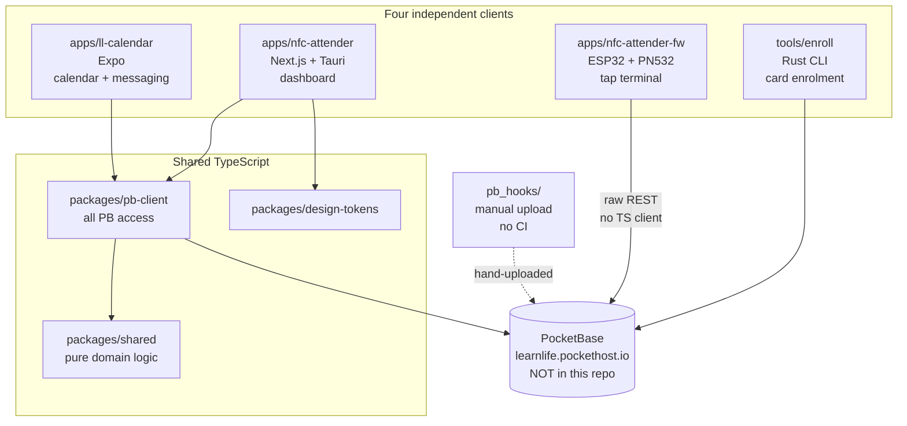

# Monorepo architecture

How the pieces fit together, and why they are split the way they are. Per-app
internals live in each app's own docs — this file is the map above them, plus
the cross-cutting facts that no single app's documentation owns.

New to the repo? Read [`GLOSSARY.md`](GLOSSARY.md) first; the vocabulary here
is domain-specific and two terms (`lg`, `arrival`) mean something narrower
than they look.

---

## The one-paragraph version

A school tracks learner attendance. Learners tap an NFC card on a desk
terminal; staff review and correct the record on a dashboard; a separate mobile
app carries the calendar and messaging. All of it is backed by **one hosted
PocketBase instance that is not in this repository**. Four independent clients
write to that instance, three shared TypeScript packages keep the two web/desktop
clients honest, and the fourth client — an ESP32 — re-implements the same rules
in C++ because it cannot import TypeScript.

---

## Workspace layout

| Path | What it is | In the pnpm workspace? |
|---|---|---|
| `apps/ll-calendar` | Expo + React Native calendar/messaging app (iOS, Android, Web) | Yes |
| `apps/nfc-attender` | Next.js + Tauri 2 desktop app — the attendance **dashboard** | Yes |
| `apps/nfc-attender-fw` | ESP32 firmware — the **tap terminal** | **No** — PlatformIO/C++ |
| `packages/pb-client` | All PocketBase access: client factory, types, constants, queries | Yes |
| `packages/shared` | Pure business logic: attendance, calendar, dates, roles, rsvp | Yes |
| `packages/design-tokens` | Colour/spacing/type tokens | Yes |
| `pb_hooks/` | Three PocketBase JS hooks, uploaded to PocketHost by hand | n/a |

`apps/nfc-attender-fw` is excluded deliberately (`pnpm-workspace.yaml`). Nothing
in it runs `pnpm`; you use `pio` from inside that directory. **Watch the
suffix** — `nfc-attender` and `nfc-attender-fw` are different apps, and CI path
filters rely on the difference.

---

## The system

The asymmetry is the important part. Three clients reach PocketBase through
`packages/pb-client`, so a schema change is one edit. The ESP32 speaks the REST
API directly — it cannot run TypeScript — so the same schema change is a second
edit in C++, with no compiler to catch the mismatch.

---

## The shared packages

Detail: [`../packages/pb-client/README.md`](../packages/pb-client/README.md),
[`../packages/shared/README.md`](../packages/shared/README.md),
[`../packages/design-tokens/README.md`](../packages/design-tokens/README.md).

**`@learnlife/pb-client`** owns every PocketBase call. Query modules are split
by collection (`queries/{attendance,auth,calendar,invites,learners,messages,rsvp}.ts`),
with types in `types.ts` and constants — PB URL, program codes, time thresholds
— in `constants.ts`. Put API calls here, not in an app.

**`@learnlife/shared`** is pure and side-effect free: no network, no clock of
its own, no storage. `computeCheckInAction()` takes state plus `now` and returns
one action. That purity is what lets the same rules be tested on a host, ported
to C++, and exercised from a serial console with an overridden clock.

**`@learnlife/design-tokens`** holds visual constants.

### The four-copy problem, and the drift it has already produced

The attendance rule and its status mapping are implemented four times:

| Where | What | Checked against the others? |
|---|---|---|
| `packages/shared/src/attendance.ts` | The specification: `computeCheckInAction`, `deriveStatus`, `splitStatus`, `findLearnersToMarkAbsent` | — |
| `packages/pb-client/src/queries/attendance.ts` | Hand-duplicated `deriveStatus` under a MUST-STAY-IN-SYNC banner | **No test asserts they agree** |
| `packages/pb-client/scripts/backfill-arrival.ts` | Its own local `splitStatus` | No |
| `apps/nfc-attender-fw/src/state_machine.cpp` | C++ port of `computeCheckInAction` | **No CI job compares them** |

Both duplications inside `pb-client` exist to avoid a dependency cycle:
`packages/shared` imports `TIME_THRESHOLDS` from `pb-client`, so `pb-client`
cannot import back.

**This is not a hypothetical risk. The copies have already diverged**, on four
verified points between `packages/shared` and the C++ port:

| # | `packages/shared` (TS) | `state_machine.cpp` (C++) | Observable consequence |
|---|---|---|---|
| 1 | Non-Friday check-out at **16:59** | **17:00** | A tap in that one minute checks out on the dashboard but not on the device |
| 2 | Evaluates check-out **before** late-lunch-return | The **reverse** order | A mid-lunch tap after check-out time sets `time_out` in TS but not on the device |
| 3 | Returns `no_action` for taps 14:00–17:00 | Has a distinct **`Locked`** action that rejects them | The device shows "Locked"; the dashboard silently does nothing |
| 4 | Has `findLearnersToMarkAbsent` | **Never ported** | The device cannot mark absences even in principle |

A fifth issue is shared by both copies rather than a divergence: inside the
lunch window `lunch_status` is computed as `now >= 14:01 ? "late" : "present"`,
but that step only runs while `hour < 14`, so the `"late"` arm is **unreachable**
and the lunch window always writes `"present"`. A late lunch can only arrive via
`late_lunch_return` or via check-out closing an open lunch, both of which
hard-code it. The C++ reproduces the same dead branch faithfully.

The C++ tests run in `nfc-fw.yml`; the TS tests run in `nfc-test-build.yml`.
Separate workflows, disjoint path filters, no shared fixture. **A rule change is
four edits, and nothing will tell you if you forget one.** If you make one, say
so in the commit message.

Why the duplication is tolerated at all: the device must work with no computer
in the loop, and it cannot import TypeScript. The alternative — the device
asking a server for every decision — loses offline operation, which is the
feature the whole firmware exists to provide. The duplication is defensible;
the *undetected drift* is not. The cheapest fix would be a shared fixture file
that both test suites load, so the two ports are checked against one table of
cases rather than two copies of it.

---

## Runtime flows

### Tap terminal (`apps/nfc-attender-fw`)

Four pinned FreeRTOS tasks, so the reader keeps responding while the network
task is blocked on TLS:

1. `nfc_task` polls the PN532 over I²C every 50 ms, debounces, emits a UID.
2. `processor_task` resolves UID to learner from the on-disk roster cache,
   checks the clock is trustworthy, runs the state machine.
3. The resulting write is appended to a durable on-disk queue **before** any
   network attempt.
4. `network_task` drains the queue to PocketBase and delta-syncs changes back.

The ordering in step 3 is the design: the queue, not the network, is the
durability boundary. See [`../apps/nfc-attender-fw/README.md`](../apps/nfc-attender-fw/README.md).

### Dashboard (`apps/nfc-attender`)

Rust polls a PC/SC reader on a background thread and emits a `nfc-scanned`
Tauri event; `useNfcLearner` queue-processes scans sequentially, resolves the
learner, runs `computeCheckInAction()`, writes to PocketBase. Next.js is in
static-export mode (`output: "export"`), so there is no SSR and no server
route — Tauri bundles the generated `/out/` as its frontend and the PocketBase
singleton lives on `window.__pb`.

This app's PC/SC tap path is legacy: the ESP32 replaced it. The dashboard
remains the surface for history, justifications, bulk edits and CSV export.
See [`../apps/nfc-attender/docs/ARCHITECTURE.md`](../apps/nfc-attender/docs/ARCHITECTURE.md).

### Calendar (`apps/ll-calendar`)

`lib/pocketbase.ts` builds a persisted PB client, `context/AuthContext.tsx`
subscribes to auth-store changes, and `useAuth()` exposes `user`,
`isAuthenticated` and `role` to Expo Router screens which branch on role.
See [`../apps/ll-calendar/docs/ARCHITECTURE.md`](../apps/ll-calendar/docs/ARCHITECTURE.md).

---

## The backend is not in this repo

Full reference: [`POCKETBASE.md`](POCKETBASE.md).

PocketBase is hosted on PocketHost. The only server-side code this repo owns is
`pb_hooks/` — three JS files, **uploaded by hand**, covered by no workflow, no
tests and no lint. Two consequences worth internalising:

- **Collection API rules are mostly not in the repo.** The device's permission
  to POST and PATCH `attendance` exists only as admin-UI state. A device cannot
  be provisioned from a fresh clone plus these docs alone. This is the project's
  largest reproducibility hole.
- **1000 requests/hour per IP** is the hard budget, shared by both terminals and
  the dashboard behind the school's single NAT address. It is not a guideline —
  it is what *derives* the device's 30 s delta-sync interval and caps the
  terminal count. Raise `kDeltaPollMs` before adding a third.

---

## Repo-wide conventions

- **TypeScript strict mode** everywhere; base config in `tsconfig.base.json`.
  Note that the base declares `lib: ["esnext"]` with no host globals — a package
  that needs `console` or `setTimeout` must add `"dom"` itself, as
  `packages/pb-client` does. This keeps `packages/shared` honestly pure.
- **Path aliases**: `@/*` → `./src/*` (nfc-attender) or `./*` (ll-calendar).
- **Styling**: Tailwind CSS 4 + Radix + Lucide in nfc-attender;
  `StyleSheet.create()` with platform-specific files (`.web.ts`, `.ios.tsx`) in
  ll-calendar.
- **The pure/impure split** in the firmware: every non-trivial decision lives in
  a host-testable module; Arduino, WiFi and LittleFS code is a thin adapter
  behind `#ifndef LLATTENDER_NATIVE_BUILD`. New logic goes on the pure side.
- **Subtree publishing**: `apps/nfc-attender` and `apps/ll-calendar` are each
  mirrored to a standalone repo (`pnpm push:nfc`, `pnpm push:calendar`), which
  is why the dashboard carries its own `.github/workflows/`.

### Testing topology

| Area | Runner | Covered by CI |
|---|---|---|
| `apps/nfc-attender` | vitest (jsdom) | Yes — `nfc-test-build.yml` |
| `apps/ll-calendar` | jest (ts-jest) | Yes — `calendar-test.yml`, but one test file, and `testMatch` cannot collect `.tsx` |
| `apps/nfc-attender-fw` | PlatformIO + Unity, 134 host cases | Yes — `nfc-fw.yml` |
| `packages/*` | **no test script** | Typecheck only |
| `apps/nfc-attender/src-tauri` | **no `#[test]` anywhere** | Compile only |
| `pb_hooks/` | none | **No workflow at all** |

The shared packages define no `test` script, so root `pnpm test` (`pnpm -r test`)
does not reach them; their only direct check is `pnpm typecheck`. Full detail and
the complete list of what CI does not cover: [`CI.md`](CI.md).

---

## Adding things

**A new shared package** — add it under `packages/`, extend `tsconfig.base.json`
if it needs host globals, give it a `typecheck` script (it will be picked up by
`pnpm typecheck` and both TS workflows automatically), write its README, and add
it to the table at the top of this file.

**A new firmware module** — put the logic on the pure side, and add it to
**both** `build_src_filter` and `test_filter` in `platformio.ini`. Those are
explicit allow-lists: a module missing from both is silently never compiled and
never run. It will not fail — it will simply not exist. See
[`../apps/nfc-attender-fw/docs/TESTING.md`](../apps/nfc-attender-fw/docs/TESTING.md).

**An attendance rule change** — all three implementations, plus their fixtures.

**A new collection or field** — `packages/pb-client/src/types.ts`, the relevant
`queries/` module, the firmware's `pb_request.*`/`fields.*` if the device needs
it, the API rules in the admin UI, and [`POCKETBASE.md`](POCKETBASE.md).

---

## Where to go next

| You want to | Read |
|---|---|
| Get a machine set up and run something | [`DEVELOPMENT.md`](DEVELOPMENT.md) |
| Understand the domain vocabulary | [`GLOSSARY.md`](GLOSSARY.md) |
| Know the backend schema and access rules | [`POCKETBASE.md`](POCKETBASE.md) |
| Know what CI does and does not check | [`CI.md`](CI.md) |
| Understand the threat model and open risks | [`SECURITY.md`](SECURITY.md) |
| Work on the device | [`../apps/nfc-attender-fw/README.md`](../apps/nfc-attender-fw/README.md) |
| Build or wire the hardware | [`../apps/nfc-attender-fw/hardware/README.md`](../apps/nfc-attender-fw/hardware/README.md) |
| Work on the dashboard | [`../apps/nfc-attender/docs/ARCHITECTURE.md`](../apps/nfc-attender/docs/ARCHITECTURE.md) |
| Work on the calendar app | [`../apps/ll-calendar/docs/ARCHITECTURE.md`](../apps/ll-calendar/docs/ARCHITECTURE.md) |
| Change attendance rules | [`../packages/shared/README.md`](../packages/shared/README.md) |
